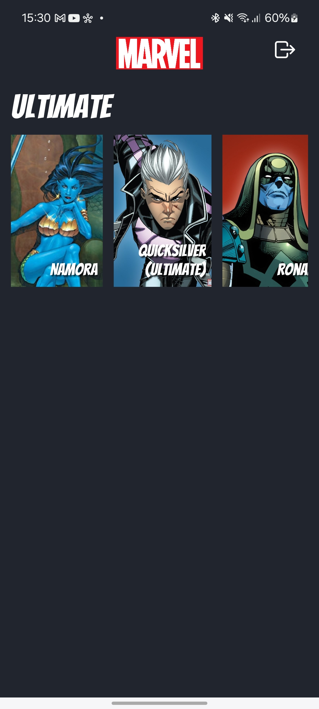

# The Marvel Comics - React Native - CheckPoint 3

## Descrição do Projeto

Este projeto é um aplicativo de informações do mundo da Marvel. O aplicativo apresenta as seguintes telas:

- **Tela principal**: Exibida quando usuário não está logado.
- **Tela de Login**: Permite efetuar o login.
- **Tela de Cadastro**: Permite efetuar o cadastro.
- **Home**: Lista as personagens presentes na série **Ultimate**.
- **Detalhe Personagem**: Apresenta os detalhes da personagem selecionada.

## Desafio

Neste desafio, você deverá consumir a API Marvel Comics, exibindo informações sobre personagens, quadrinhos e histórias do universo Marvel.
O aplicativo exigirá que o usuário crie uma conta para acessá-lo, e o serviço Firebase Auth deverá ser utilizado para a autenticação.
Será avaliada a sua capacidade em consumir APIs RESTful e integrar autenticação.

### Pré-requisito

- **Adicionar Nomes e RM dos Integrantes**:
  - Antes de iniciar o desenvolvimento, adicionem seus nomes e números de RM na tela inicial do aplicativo.
  - Isso é importante para a identificação dos membros da equipe e para garantir
  a atribuição adequada das contribuições de cada um.

### Funcionalidades a serem implementadas

1. **Login**:
   - Implementar o login utilizando o Firebase Auth.

2. **Cadastro**:
   - Implementar o cadastro utilizando o Firebase Auth.

3. **Logout**:
   - Permitir o usuário logado efetuar o logout.

4. **Listar personagens da série**:
   - Recuperar os dados de personagens da API da série **Ultimate**.
   - Endpoint: https://gateway.marvel.com/v1/public/characters?series=702

5. **Exibir os detalhes da personagem selecionada**:
   - Recuperar os dados de uma personagem específica.
   - Endpoint: https://gateway.marvel.com/v1/public/characters/{ID}

## Estrutura da aplicação

- A API da Marvel necessita de chaves para acesso, o código já está preparado para o envio das mesmas. Não se preocupe com isso.
  - Verifique a estrutura do arquivo `./src/network/marvelApi.ts`.
  - Como sugestão para implementação do acesso a API, existem dois arquivos, um para cada endpoint. Fique à vontade para usá-los ou crie sua própria estrutura.
    - `./src/network/marvel/getCharacter.ts`
    - `./src/network/marvel/getCharacters.ts`
- Para acesso ao Firebase Auth também são necessárias credenciais de acesso. Novamente, já existem credenciais no projeto, não necessitando de nenhuma configuração extra.
  - Verifique a estrutura do arquivo `./firebaseConfig.ts`.
- Os layouts estão todos prontos, não há a necessidade de alterá-los. Mas caso deseje, fique à vontade para modificar.

## Dicas Adicionais

- Sinta-se à vontade para consultar a documentação do React Native e outras bibliotecas que você está utilizando.
- Se necessário, utilize comentários no código para explicar partes importantes da lógica implementada.
- Mantenha o código limpo e bem organizado.

## Entrega

### Regras de Submissão - Commits e Pushes

Durante a realização do checkpoint, os seguintes procedimentos de versionamento
de código devem ser seguidos **rigorosamente**:

- **_Commits_ e _pushes_ a cada 15 minutos**:
  - É **obrigatório** realizar pelo menos **um commit** no repositório local e
  **um push** para o repositório remoto a cada **15 minutos** durante o checkpoint.
  - O commit deve refletir o progresso do código até aquele momento e ser
  acompanhado de uma mensagem descritiva e clara.

- **Proibição de `git push --force`**:
  - **Não é permitido** o uso do comando `git push --force` ou qualquer variação
  que force a sobrescrita do histórico de commits. Isso resultará em **penalidades**.

- **Penalidades**:
  - Para cada intervalo de 15 minutos em que não houver um commit e push
  válidos, será aplicada uma **penalização**.
  - O uso de `git push --force` acarretará a **anulação total do checkpoint**,
  resultando em nota zero.
  - O não cumprimento das regras de commits e pushes pode resultar na anulação
  total do checkpoint, zerando a nota.

Quando finalizar a implementação, envie um push com suas alterações.

Boa sorte e divirta-se programando!

## Screenshots

